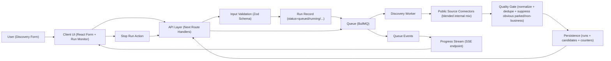

# Phase 1: Discovery Targeting and Runs - Research

**Researched:** 2026-04-17  
**Domain:** Discovery-run orchestration, candidate domain sourcing, and real-time progress UX for lead generation  
**Confidence:** MEDIUM

<user_constraints>
## User Constraints (from CONTEXT.md)

### Locked Decisions
- **D-01:** Discovery requires `keyword/niche` and `country`; `city` and `language` remain optional filters.
- **D-02:** Target platform filter is explicit and required at run setup: `WordPress`, `Shopify`, or `Both`.
- **D-03:** v1 uses a blended internal set of public sources; the UI does not expose per-source toggles.
- **D-04:** Discovery should prioritize relevance over volume and avoid low-value bulk expansion behavior.
- **D-05:** Candidate output applies a basic quality gate before display: domain deduplication, canonical root normalization, and obvious non-business/parked domain suppression.
- **D-06:** Near-duplicate domains should be collapsed when they represent the same business target.
- **D-07:** Discovery runs execute asynchronously with live progress updates and incremental result visibility.
- **D-08:** User can stop an in-flight run; completed/aborted run metadata remains visible for traceability.

### Claude's Discretion
- Exact provider weighting and ranking heuristic composition can be decided during planning/research, as long as the quality-first principle is preserved.
- Internal persistence details for run history are open to implementation choice.

### Deferred Ideas (OUT OF SCOPE)
None - discussion stayed within phase scope.
</user_constraints>

<phase_requirements>
## Phase Requirements

| ID | Description | Research Support |
|----|-------------|------------------|
| DISC-01 | User can define lead discovery criteria by niche/keyword, country, city, and language | Strong input contract via `zod` + `react-hook-form` with required/optional semantics; API schema reuse for server validation. [CITED: https://github.com/react-hook-form/resolvers/blob/master/README.md] [CITED: https://github.com/colinhacks/zod/blob/main/packages/docs/content/basics.mdx] |
| DISC-02 | User can filter target stack as WordPress, Shopify, or both | Run payload includes mandatory enum for platform target; provider queries and quick platform prefilter apply this enum before candidate acceptance. [ASSUMED] |
| DISC-03 | User can start a discovery run that returns candidate public business domains | Asynchronous run model with queue-backed workers plus canonicalization and dedupe gate before persistence/display. [CITED: https://docs.bullmq.io/guide/events] [CITED: https://github.com/remusao/tldts/blob/master/README.md] |
| DISC-04 | User can view discovery run progress and total discovered domains | `QueueEvents` + persisted counters + SSE progress stream endpoint for live UI updates. [CITED: https://docs.bullmq.io/guide/events] [CITED: https://developer.mozilla.org/en-US/docs/Web/API/Server-sent_events/Using_server-sent_events] [CITED: https://nextjs.org/docs/app/getting-started/route-handlers] |
</phase_requirements>

## Summary

Phase 1 should be planned as a narrow but production-minded pipeline: validated targeting input -> asynchronous discovery run -> incremental candidate ingestion -> live progress telemetry -> operator stop control. This fits all locked decisions and avoids coupling this phase to deeper scan/signal/scoring concerns. [VERIFIED: .planning/phases/01-discovery-targeting-and-runs/01-CONTEXT.md] [VERIFIED: .planning/ROADMAP.md]

The strongest implementation baseline for this repo is a TypeScript full-stack app using Next.js Route Handlers for API endpoints, BullMQ for asynchronous run execution, `tldts` for domain normalization, and SSE for one-way progress streaming. This supports incremental visibility, queue control semantics, and clean separation between UI and run workers. [CITED: https://nextjs.org/docs/app/getting-started/route-handlers] [CITED: https://docs.bullmq.io/guide/events] [CITED: https://github.com/remusao/tldts/blob/master/README.md] [CITED: https://developer.mozilla.org/en-US/docs/Web/API/Server-sent_events/Using_server-sent_events]

Given current environment state (Redis missing, Postgres not running), planning must include a Wave 0 bootstrap for runtime dependencies or choose documented fallbacks (e.g., `pg-boss` over Redis queue). [VERIFIED: local shell checks] [VERIFIED: npm registry]

**Primary recommendation:** Plan Phase 1 around a queue-backed async discovery workflow with SSE progress, strict request validation, and domain quality-gate normalization as first-class components.

## Architectural Responsibility Map

| Capability | Primary Tier | Secondary Tier | Rationale |
|------------|-------------|----------------|-----------|
| Discovery criteria form (keyword/country/city/language/platform) | Browser / Client | API / Backend | Client handles UX and immediate feedback; backend enforces canonical validation contract. [CITED: https://github.com/react-hook-form/resolvers/blob/master/README.md] [CITED: https://github.com/colinhacks/zod/blob/main/packages/docs/content/basics.mdx] |
| Start/stop discovery run | API / Backend | Database / Storage | Start/stop are state transitions and must be authoritative server actions with durable run metadata. [ASSUMED] |
| Source querying and candidate generation | API / Backend (worker) | Database / Storage | External source IO and ranking should run off the request thread and persist incrementally. [ASSUMED] |
| Canonicalization + dedupe + near-duplicate collapse | API / Backend | Database / Storage | Normalization logic is deterministic server logic; DB uniqueness/indexes enforce idempotency. [CITED: https://github.com/remusao/tldts/blob/master/README.md] [ASSUMED] |
| Live progress and counters | API / Backend | Browser / Client | Queue events and run counters originate server-side; client subscribes via SSE/polling fallback. [CITED: https://docs.bullmq.io/guide/events] [CITED: https://developer.mozilla.org/en-US/docs/Web/API/Server-sent_events/Using_server-sent_events] |

## Standard Stack

### Core
| Library | Version | Purpose | Why Standard |
|---------|---------|---------|--------------|
| `next` | `16.2.4` (published 2026-04-15) [VERIFIED: npm registry] | Full-stack React framework with Route Handlers for API endpoints | Route Handlers provide typed request/response APIs in the App Router and simplify BFF-style architecture for this phase. [CITED: https://nextjs.org/docs/app/getting-started/route-handlers] |
| `react` + `react-dom` | `19.2.5` / `19.2.5` (published 2026-04-08) [VERIFIED: npm registry] | Discovery UI and reactive progress display | Required foundation for Next.js App Router UI. [CITED: https://nextjs.org/docs/app] |
| `typescript` | `6.0.3` (published 2026-04-16) [VERIFIED: npm registry] | Type-safe contracts between form, API, worker, and persistence | Reduces contract drift across run payload, queue job payload, and API responses. [ASSUMED] |
| `zod` | `4.3.6` (published 2026-01-22) [VERIFIED: npm registry] | Runtime validation for request payloads and filters | `parse/safeParse` pattern is explicit and predictable for input validation boundaries. [CITED: https://github.com/colinhacks/zod/blob/main/packages/docs/content/basics.mdx] |
| `react-hook-form` + `@hookform/resolvers` | `7.72.1` / `5.2.2` (published 2026-04-03 / 2025-09-14) [VERIFIED: npm registry] | High-performance form state + shared Zod schema resolver | Keeps form validation aligned with backend schema expectations. [CITED: https://github.com/react-hook-form/resolvers/blob/master/README.md] |
| `bullmq` + `ioredis` | `5.74.1` / `5.10.1` (published 2026-04-15 / 2026-03-19) [VERIFIED: npm registry] | Async run orchestration, worker processing, lifecycle/progress events | Queue events and progress signaling are built-in and production-proven for long-running discovery tasks. [CITED: https://docs.bullmq.io/guide/events] [CITED: https://docs.bullmq.io/guide/connections] |
| `tldts` | `7.0.28` (published 2026-04-04) [VERIFIED: npm registry] | Canonical root-domain extraction and normalization | Prevents brittle custom hostname parsing and supports robust dedupe keys. [CITED: https://github.com/remusao/tldts/blob/master/README.md] |

### Supporting
| Library | Version | Purpose | When to Use |
|---------|---------|---------|-------------|
| `prisma` + `@prisma/client` | `7.7.0` / `7.7.0` (published 2026-04-07) [VERIFIED: npm registry] | Run/candidate persistence and migration workflow | Use when choosing PostgreSQL-backed persistence for run history/candidates. [CITED: https://github.com/prisma/prisma/blob/main/packages/migrate/README.md] |
| `p-queue` | `9.1.2` (published 2026-04-07) [VERIFIED: npm registry] | In-process bounded concurrency utility | Use only for local fallback if external queue infra is unavailable. [ASSUMED] |

### Alternatives Considered
| Instead of | Could Use | Tradeoff |
|------------|-----------|----------|
| `bullmq` + Redis | `pg-boss` (`12.15.0`, published 2026-03-30) [VERIFIED: npm registry] | `pg-boss` removes Redis dependency but gives a different operational model and smaller ecosystem than BullMQ. [ASSUMED] |
| Next Route Handlers | Separate API server (Express/Fastify) | Separate server increases deployment complexity for a first phase with limited scope. [ASSUMED] |
| `tldts` | Custom `URL`/regex parsing | Custom parsing fails on many suffix edge-cases; maintenance risk is high. [CITED: https://github.com/remusao/tldts/blob/master/README.md] |

**Installation:**
```bash
npm install next@16.2.4 react@19.2.5 react-dom@19.2.5 zod@4.3.6 react-hook-form@7.72.1 @hookform/resolvers@5.2.2 bullmq@5.74.1 ioredis@5.10.1 tldts@7.0.28 prisma@7.7.0 @prisma/client@7.7.0
npm install -D typescript@6.0.3 vitest@4.1.4 @playwright/test@1.59.1
```

**Version verification:**  
All versions and publish dates above were validated via `npm view <package> version` and `npm view <package> time --json` on 2026-04-17. [VERIFIED: npm registry]

## Architecture Patterns

### System Architecture Diagram



### Recommended Project Structure
```text
src/
├── app/
│   ├── (discovery)/
│   │   ├── page.tsx                 # Discovery criteria + run monitor UI
│   │   └── components/              # Criteria form, run status, candidate list
│   └── api/
│       ├── discovery-runs/route.ts  # Start run, list runs
│       ├── discovery-runs/[id]/route.ts
│       └── discovery-runs/[id]/events/route.ts  # SSE stream
├── server/
│   ├── discovery/
│   │   ├── schema.ts                # zod contracts
│   │   ├── orchestrator.ts          # run lifecycle + queue dispatch
│   │   ├── providers/               # source adapters
│   │   ├── quality-gate.ts          # canonicalize, dedupe, suppress
│   │   └── platform-filter.ts       # WordPress/Shopify/both prefilter
│   ├── queue/
│   │   ├── client.ts                # BullMQ queue init
│   │   └── worker.ts                # discovery worker entrypoint
│   └── db/
│       ├── schema/                  # prisma schema + migrations
│       └── repositories/            # runs/candidates persistence
└── tests/
    ├── discovery/
    └── api/
```

### Pattern 1: Contract-First Discovery Run Payload
**What:** One shared schema validates inputs at form submit and API boundary. [CITED: https://github.com/colinhacks/zod/blob/main/packages/docs/content/basics.mdx]  
**When to use:** Every mutation endpoint (`start`, `stop`, filter changes).  
**Example:**
```typescript
// Source: https://github.com/colinhacks/zod/blob/main/packages/docs/content/basics.mdx
import { z } from "zod";

export const DiscoveryRunInput = z.object({
  keyword: z.string().min(2),
  country: z.string().min(2),
  city: z.string().optional(),
  language: z.string().optional(),
  platform: z.enum(["wordpress", "shopify", "both"])
});
```

### Pattern 2: Event-Driven Run Progress
**What:** Worker updates progress and emits queue events; API exposes aggregated progress via SSE. [CITED: https://docs.bullmq.io/guide/events] [CITED: https://developer.mozilla.org/en-US/docs/Web/API/Server-sent_events/Using_server-sent_events]  
**When to use:** Long-running discovery runs with incremental result visibility.  
**Example:**
```typescript
// Source: https://docs.bullmq.io/guide/events
queueEvents.on("progress", ({ jobId, data }) => {
  // update run progress counters in persistence
});
```

### Pattern 3: Canonical-Domain Keying Before Persist
**What:** Normalize incoming URLs to canonical domain key before dedupe/write. [CITED: https://github.com/remusao/tldts/blob/master/README.md]  
**When to use:** Every provider output path before candidate insertion.  
**Example:**
```typescript
// Source: https://github.com/remusao/tldts/blob/master/README.md
import { parse } from "tldts";

export function canonicalDomainKey(input: string): string | null {
  const parsed = parse(input, { allowPrivateDomains: true });
  return parsed.domain ?? null;
}
```

### Anti-Patterns to Avoid
- **Blocking HTTP request for full discovery completion:** creates timeouts and no incremental visibility; use async queue + streamed/polled status instead. [ASSUMED]
- **Provider-specific fields leaking into DB schema/UI:** breaks internal source blending decision (D-03); normalize provider payloads into one internal candidate model. [VERIFIED: .planning/phases/01-discovery-targeting-and-runs/01-CONTEXT.md]
- **String-based URL dedupe without canonicalization:** causes duplicates (`www`, protocol, subdomain variance). [CITED: https://github.com/remusao/tldts/blob/master/README.md]

## Don't Hand-Roll

| Problem | Don't Build | Use Instead | Why |
|---------|-------------|-------------|-----|
| Async orchestration | Custom in-memory job runner with ad-hoc retries | `bullmq` | Built-in queue lifecycle, events, and operational tooling reduce failure modes. [CITED: https://docs.bullmq.io/guide/events] |
| Domain parsing/normalization | Regex-based hostname splitter | `tldts` | Public suffix and domain edge cases are non-trivial and already solved. [CITED: https://github.com/remusao/tldts/blob/master/README.md] |
| Form+API validation drift | Separate hand-maintained validation rules | `zod` schema shared with RHF resolver | One source of truth for required/optional filters and enum constraints. [CITED: https://github.com/react-hook-form/resolvers/blob/master/README.md] |
| Real-time progress transport | Custom websocket protocol for one-way updates | SSE (`text/event-stream`) | One-way server-to-client updates are simpler and standards-based for this use case. [CITED: https://developer.mozilla.org/en-US/docs/Web/API/Server-sent_events/Using_server-sent_events] |

**Key insight:** Discovery runs are IO-bound and stateful; queue semantics, domain parsing, and schema validation are mature problems with proven libraries, and custom implementations would mostly add risk rather than product value. [ASSUMED]

## Common Pitfalls

### Pitfall 1: Violating Public Source Usage Policies
**What goes wrong:** Discovery gets throttled/blocked or becomes non-compliant. [CITED: https://operations.osmfoundation.org/policies/nominatim/]  
**Why it happens:** No explicit per-provider rate and attribution enforcement in run orchestration. [ASSUMED]  
**How to avoid:** Encode provider policies in connector configs (requests/sec, user-agent, attribution) and enforce centrally. [CITED: https://operations.osmfoundation.org/policies/nominatim/]  
**Warning signs:** Spike in 429/403 responses or rapid drop in source yield. [ASSUMED]

### Pitfall 2: Progress Counters Diverge from Stored Results
**What goes wrong:** UI shows counts that do not match persisted candidate totals. [ASSUMED]  
**Why it happens:** Progress emitted from worker memory, but persistence writes fail/retry independently. [ASSUMED]  
**How to avoid:** Treat DB write success as the event that increments durable counters; stream persisted counters. [ASSUMED]  
**Warning signs:** Re-opened run shows lower totals than live run monitor previously showed. [ASSUMED]

### Pitfall 3: Under-normalized Dedupe
**What goes wrong:** Same business appears multiple times with URL variants. [ASSUMED]  
**Why it happens:** Dedupe key uses raw URL string instead of canonical domain/root rules. [CITED: https://github.com/remusao/tldts/blob/master/README.md]  
**How to avoid:** Normalize to canonical domain key first, then apply near-duplicate collapse rules. [CITED: https://github.com/remusao/tldts/blob/master/README.md] [ASSUMED]  
**Warning signs:** High duplicate ratio by shared registrable domain. [ASSUMED]

## Code Examples

Verified patterns from official sources:

### Next.js Route Handler for Progress Stream
```typescript
// Source: https://nextjs.org/docs/app/getting-started/route-handlers
export async function GET() {
  const encoder = new TextEncoder();
  const stream = new ReadableStream({
    async start(controller) {
      controller.enqueue(encoder.encode("event: ready\\ndata: ok\\n\\n"));
    },
  });

  return new Response(stream, {
    headers: {
      "Content-Type": "text/event-stream",
      "Cache-Control": "no-cache",
    },
  });
}
```

### BullMQ Global Queue Event Subscription
```typescript
// Source: https://docs.bullmq.io/guide/events
import { QueueEvents } from "bullmq";

const queueEvents = new QueueEvents("discovery-runs");

queueEvents.on("completed", ({ jobId }) => {
  // mark run complete
});

queueEvents.on("failed", ({ jobId, failedReason }) => {
  // mark run failed
});

queueEvents.on("progress", ({ jobId, data }) => {
  // update progress counters
});
```

### Zod Safe Parse at API Boundary
```typescript
// Source: https://github.com/colinhacks/zod/blob/main/packages/docs/content/basics.mdx
const result = DiscoveryRunInput.safeParse(payload);
if (!result.success) {
  return { status: 400, errors: result.error.issues };
}
```

## State of the Art

| Old Approach | Current Approach | When Changed | Impact |
|--------------|------------------|--------------|--------|
| Pages Router API routes as primary API layer | App Router Route Handlers are first-class for request handlers | Route Handlers introduced in `v13.2.0`; docs recommend App Router for latest features [CITED: https://nextjs.org/docs/app/api-reference/file-conventions/route] [CITED: https://nextjs.org/docs/pages] | Prefer App Router for new Phase 1 work. |
| BullMQ `QueueScheduler` as default queue component | `QueueScheduler` deprecated for BullMQ `2.0+` | BullMQ docs mark deprecation for 2.0 onward [CITED: https://docs.bullmq.io/guide/queuescheduler] | Do not plan new code around `QueueScheduler`. |
| Nominatim `search.php` endpoint | `search.php` is deprecated; use `/search` endpoint format | Nominatim docs flag deprecation in current API docs [CITED: https://nominatim.org/release-docs/latest/api/Search/] | Connector implementation should avoid deprecated endpoint shape. |

**Deprecated/outdated:**
- `QueueScheduler` in new BullMQ designs: deprecated from BullMQ 2.0 onward. [CITED: https://docs.bullmq.io/guide/queuescheduler]
- Nominatim `search.php` URL form: deprecated and marked for removal. [CITED: https://nominatim.org/release-docs/latest/api/Search/]

## Assumptions Log

| # | Claim | Section | Risk if Wrong |
|---|-------|---------|---------------|
| A1 | `bullmq` should be the default queue for Phase 1 over `pg-boss` | Standard Stack | Could force avoidable Redis dependency and slow initial delivery. |
| A2 | WordPress/Shopify prefilter can be implemented with lightweight fingerprints before deep scan | Phase Requirements, Patterns | Platform-filter precision may be lower than expected until later scan phases. |
| A3 | Parked/non-business suppression can be handled by deterministic heuristics in Phase 1 | User Constraints alignment, Pitfalls | False positives/negatives may remove good candidates or keep low-quality ones. |
| A4 | Blended source mix should start with OSM-derived connectors plus optional web-search style connectors | Architecture Patterns | Source yield may be insufficient for some niches/regions. |
| A5 | SSE is sufficient for run progress UX in this phase without WebSockets | Summary, Code Examples | Some edge clients/proxies may require fallback polling behavior. |

## Open Questions (RESOLVED)

1. **Initial blended provider set**
   - **Decision:** Phase 1 baseline provider mix is fixed to a blended internal set of three adapters: (a) OSM Nominatim `/search`, (b) OSM Overpass website extraction queries, and (c) a generic web-search adapter; the UI exposes no per-source controls per D-03.
   - **Execution implication:** Provider adapters must normalize to one internal candidate contract and apply deterministic relevance weights (`web-search` high confidence, `nominatim` medium, `overpass` medium-low) before quality-gate filtering.

2. **Platform prefilter strictness**
   - **Decision:** For `platform=wordpress` or `platform=shopify`, accept only positive platform fingerprint matches at Phase 1 intake; for `platform=both`, accept positive matches for either plus `unknown` candidates with a relevance penalty (never a boost).
   - **Execution implication:** Filtering remains quality-first (D-04), avoids false inclusion for single-platform runs, and still allows discovery breadth when user explicitly chooses `both`.

## Environment Availability

| Dependency | Required By | Available | Version | Fallback |
|------------|------------|-----------|---------|----------|
| Node.js | Next.js app + worker runtime | ✓ | `v20.20.0` [VERIFIED: local shell checks] | — |
| npm | Dependency/tooling workflow | ✓ | `10.8.2` [VERIFIED: local shell checks] | — |
| PostgreSQL server | Durable run/candidate persistence (if selected) | ✗ (client installed, server not responding) [VERIFIED: local shell checks] | `psql 16.10` client | Start local Postgres via Docker or switch to SQLite for Wave 0. [ASSUMED] |
| Redis | BullMQ queue/event backend | ✗ [VERIFIED: local shell checks] | — | Use `pg-boss` or temporary in-process fallback until Redis is provisioned. [ASSUMED] |
| Docker daemon | Fast local infra bootstrap | ✓ | `28.3.2` [VERIFIED: local shell checks] | Manual local service installs |
| pnpm | Optional package manager | ✗ [VERIFIED: local shell checks] | — | Use npm (already available). |

**Missing dependencies with no fallback:**
- None for planning; execution will need either Redis provisioned or queue fallback selected. [ASSUMED]

**Missing dependencies with fallback:**
- Redis missing -> `pg-boss`/in-process temporary fallback.
- PostgreSQL service not running -> Dockerized Postgres or SQLite bootstrap.

## Validation Architecture

### Test Framework
| Property | Value |
|----------|-------|
| Framework | Vitest `4.1.4` (+ Playwright `1.59.1` for browser flows) [VERIFIED: npm registry] |
| Config file | none — see Wave 0 [VERIFIED: repository file scan] |
| Quick run command | `npx vitest run --passWithNoTests tests/discovery` |
| Full suite command | `npx vitest run && npx playwright test` |

### Phase Requirements → Test Map
| Req ID | Behavior | Test Type | Automated Command | File Exists? |
|--------|----------|-----------|-------------------|-------------|
| DISC-01 | Criteria validation for required/optional fields | unit | `npx vitest run tests/discovery/input-schema.test.ts -t "validates required fields"` | ❌ Wave 0 |
| DISC-02 | Platform enum selection and API enforcement | unit | `npx vitest run tests/discovery/platform-filter.test.ts -t "accepts wordpress shopify both"` | ❌ Wave 0 |
| DISC-03 | Start run enqueues async job and stores initial metadata | integration | `npx vitest run tests/api/discovery-runs.start.test.ts` | ❌ Wave 0 |
| DISC-04 | Progress endpoint streams/returns increasing discovered counts | integration | `npx vitest run tests/api/discovery-runs.progress.test.ts` | ❌ Wave 0 |

### Sampling Rate
- **Per task commit:** `npx vitest run tests/discovery tests/api/discovery-runs --passWithNoTests`
- **Per wave merge:** `npx vitest run`
- **Phase gate:** `npx vitest run && npx playwright test`

### Wave 0 Gaps
- [ ] `package.json` test scripts (`test`, `test:quick`, `test:e2e`) — absent today.
- [ ] `vitest.config.ts` — framework config missing.
- [ ] `playwright.config.ts` — browser flow harness missing.
- [ ] `tests/discovery/*.test.ts` — no discovery unit tests yet.
- [ ] `tests/api/discovery-runs*.test.ts` — no API integration tests yet.

## Security Domain

### Applicable ASVS Categories

| ASVS Category | Applies | Standard Control |
|---------------|---------|-----------------|
| V2 Authentication | no (phase scope does not add auth mechanisms) [ASSUMED] | Reuse existing auth layer when present; do not introduce phase-specific auth. [ASSUMED] |
| V3 Session Management | no (phase scope does not change session model) [ASSUMED] | Keep session handling in shared app middleware. [ASSUMED] |
| V4 Access Control | yes (run ownership and stop controls) [ASSUMED] | Enforce run ownership checks in start/stop/read endpoints. [ASSUMED] |
| V5 Input Validation | yes | Zod schema validation at API boundary for all discovery payloads. [CITED: https://github.com/colinhacks/zod/blob/main/packages/docs/content/basics.mdx] |
| V6 Cryptography | no (no new cryptographic protocol in this phase) [ASSUMED] | Use platform TLS defaults for external API calls; no custom crypto. [ASSUMED] |

### Known Threat Patterns for TypeScript + queue + public-source discovery stack

| Pattern | STRIDE | Standard Mitigation |
|---------|--------|---------------------|
| Query parameter abuse causing oversized runs | Denial of Service | Hard caps on sources/pages per run, queue concurrency limits, and per-user rate limits. [ASSUMED] |
| Injection through user-supplied filters into DB operations | Tampering | Parameterized ORM/SQL writes and strict schema validation. [CITED: https://github.com/colinhacks/zod/blob/main/packages/docs/content/basics.mdx] [ASSUMED] |
| Unauthorized run stop/read actions | Elevation of Privilege | Ownership checks on run ID for every mutation/read endpoint. [ASSUMED] |
| Provider policy non-compliance | Repudiation / Availability | Provider-specific rate limits, user-agent identification, attribution requirements. [CITED: https://operations.osmfoundation.org/policies/nominatim/] |

## Sources

### Primary (HIGH confidence)
- `/vercel/next.js` (Context7 via CLI) - Route Handlers, streaming patterns, version-history notes.  
- `/taskforcesh/bullmq` (Context7 via CLI) - queue events, progress events, connection model.  
- `/colinhacks/zod` (Context7 via CLI) - parse/safeParse validation model.  
- `/react-hook-form/resolvers` (Context7 via CLI) - zodResolver integration pattern.  
- `/remusao/tldts` (Context7 via CLI) - canonical domain parsing functions.  
- npm registry (`npm view`) - package versions and publish dates validated on 2026-04-17.  
- https://nextjs.org/docs/app/getting-started/route-handlers  
- https://nextjs.org/docs/app/api-reference/file-conventions/route  
- https://nextjs.org/docs/pages  
- https://docs.bullmq.io/guide/events  
- https://docs.bullmq.io/guide/connections  
- https://docs.bullmq.io/guide/queuescheduler  
- https://developer.mozilla.org/en-US/docs/Web/API/Server-sent_events/Using_server-sent_events  
- https://nominatim.org/release-docs/latest/api/Search/  
- https://operations.osmfoundation.org/policies/nominatim/  
- https://wiki.openstreetmap.org/wiki/Overpass_API  
- https://wiki.openstreetmap.org/wiki/Overpass_API/Overpass_QL  
- https://wiki.openstreetmap.org/wiki/Key:website

### Secondary (MEDIUM confidence)
- None.

### Tertiary (LOW confidence)
- None (all low-confidence claims are explicitly marked `[ASSUMED]` and tracked in Assumptions Log).

## Metadata

**Confidence breakdown:**
- Standard stack: MEDIUM - versions are verified, but stack selection still depends on unresolved infra decisions (Redis vs non-Redis queue).
- Architecture: MEDIUM - aligns strongly to locked decisions, but provider weighting and platform prefilter precision remain open.
- Pitfalls: MEDIUM - policy/canonicalization pitfalls are documented with sources; run-quality heuristics are assumption-backed.

**Research date:** 2026-04-17  
**Valid until:** 2026-05-17
